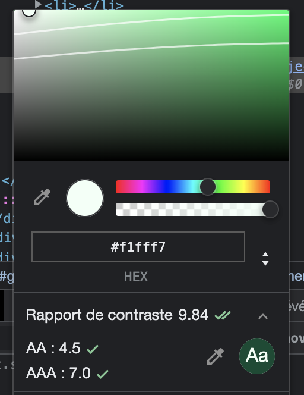

Hi there,

I decided to start TIL (Today I Learned) series ! 

Rodrigo, author of [Mathspp](https://mathspp.com/) blog, give me envy to do so with his TIL series, as I told him, I will do that to help me to remind me some stuff and share what I discovered to everyone who can be interested on. I'm dedicating my first TIL of a great series to him I hope.

I started to create a dark mode for Django project and I face to an interesting issue : accessibility.

This is something I’m aware of, but I discovered I have so many things to learn ! 
Even my website is really bad for accessibility.. but I learned some ressources very useful which deserve to be written somewhere.

Accessibility concern many cases : *Tritanopia*, *Deuteranomaly* and so on. 

[Whocanuse](https://whocanuse.com/), is based on the same purpose of [Caniuse](https://caniuse.com/) but for accessibility and contrast. 

It’s really useful to see the simulation of color for each type of vision and contrast with another color. It really helps me to better adjust color contrast.

Note: you can also see color contrast and ratio in devtools of Chrome :

You also have [Kontrasto](https://kontrasto.netlify.app/), created by Thibaud Colas, which have a deep interest in accessibility 🙂

Really nice to see a way to improve accessibility with images.

I also discovered [Link Contrast Checker](https://webaim.org/resources/linkcontrastchecker/) which is a website to see the contrast for links to be sure there are no violation for accessibility.

I find [accessibility checklist](https://www.a11yproject.com/checklist/) which can be a good start to make you website more inclusive and see some point you missed.

As I am a big fan of pipelines, there are also tools to check accessibility with desktop extension or in continuous integration: 

- [aXe](https://www.deque.com/axe/)
- [pa11y](https://pa11y.org/)
- ...

That's it for now! I hope it will be useful for someone.